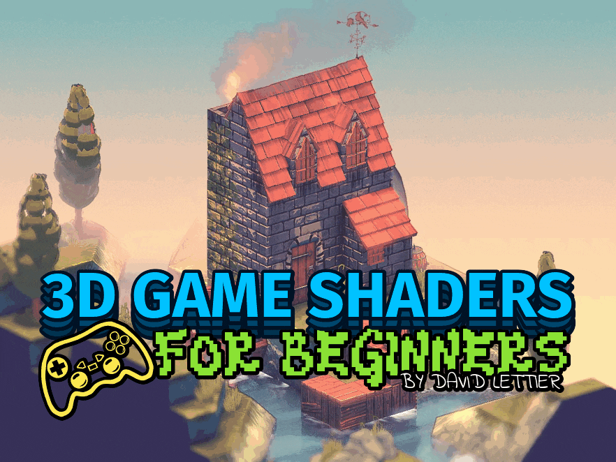

# 从零开始学3D游戏着色器编程

你有兴趣将纹理，光照，阴影，法线贴图，发光体，环境光遮蔽，反射，折射和其他更多效果添加到你的3D游戏中么?

很好!

以下的一组着色器技术将把你的游戏视觉效果提升至新高度。

我将详细解释各种技术，这样你就可以将这些技术应用到任何你使用的技术栈上——无论是Godot，Unity，Unreal或者是其他游戏引擎上。

对于着色器之间的胶水，我专门选择了Panda3D游戏引擎和OpenGL着色语言(GLSL)。所以如果你也准备使用它们作为技术栈，那么你也将学到如何用Panda3D和OpenGL实现这些着色器技术。

## Table Of Contents

- [环境准备](setup.md)
- [编译示例](building-the-demo.md)
- [运行示例](running-the-demo.md)
- [Reference Frames](sections/reference-frames.md)
- [GLSL](sections/glsl.md)
- [Render To Texture](sections/render-to-texture.md)
- [Texturing](sections/texturing.md)
- [Lighting](sections/lighting.md)
- [Blinn-Phong](sections/blinn-phong.md)
- [Fresnel Factor](sections/fresnel-factor.md)
- [Rim Lighting](sections/rim-lighting.md)
- [Cel Shading](sections/cel-shading.md)
- [Normal Mapping](sections/normal-mapping.md)
- [Deferred Rendering](sections/deferred-rendering.md)
- [Fog](sections/fog.md)
- [Blur](sections/blur.md)
- [Bloom](sections/bloom.md)
- [SSAO](sections/ssao.md)
- [Motion Blur](sections/motion-blur.md)
- [Chromatic Aberration](sections/chromatic-aberration.md)
- [Screen Space Reflection](sections/screen-space-reflection.md)
- [Screen Space Refraction](sections/screen-space-refraction.md)
- [Foam](sections/foam.md)
- [Flow Mapping](sections/flow-mapping.md)
- [Outlining](sections/outlining.md)
- [Depth Of Field](sections/depth-of-field.md)
- [Posterization](sections/posterization.md)
- [Pixelization](sections/pixelization.md)
- [Sharpen](sections/sharpen.md)
- [Dilation](sections/dilation.md)
- [Film Grain](sections/film-grain.md)
- [Lookup Table (LUT)](sections/lookup-table.md)
- [Gamma Correction](sections/gamma-correction.md)

## License

The included license applies only to the software portion of 3D Game Shaders For Beginners—
specifically the `.cxx`, `.vert`, and `.frag` source code files.
No other portion of 3D Game Shaders For Beginners has been licensed for use.

## Attributions

- [Kiwi Soda Font](https://fontenddev.com/fonts/kiwi-soda/)

## Copyright

(C) 2019 David Lettier
 
[lettier.com](https://www.lettier.com)
