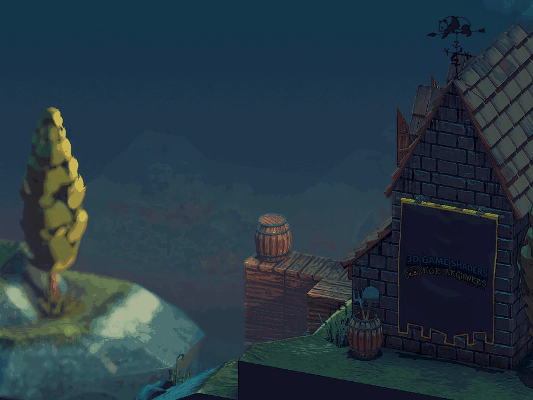
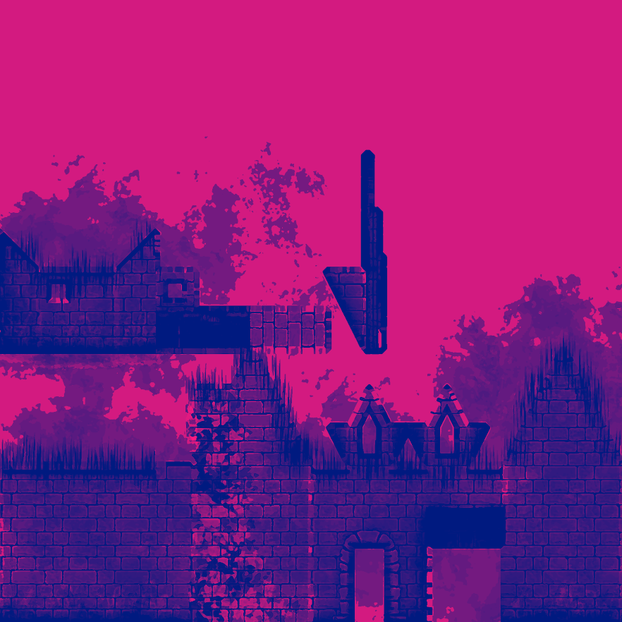

[:arrow_backward:](gamma-correction.md)
[:arrow_double_up:](../README.md)
[:arrow_up_small:](#)
[:arrow_down_small:](#copyright)
[:arrow_forward:](building-the-demo.md)

# 从零开始学3D游戏着色器编程

## 环境准备



下面是用于开发和测试示例代码的设置。

### 开发环境

示例代码是使用以下环境开发和测试的:

- Linux manjaro 5.10.42-1-MANJARO
- OpenGL renderer string: GeForce GTX 970/PCIe/SSE2
- OpenGL version string: 4.6.0 NVIDIA 465.31
- g++ (GCC) 11.1.0
- Panda3D 1.10.9

### 材质

用于构建  `mill-scene.egg`  的每个 [Blender](https://blender.org) 材质都有五种纹理

- Diffuse 漫反射
- Normal 法线
- Specular 镜面反射
- Reflection 反射
- Refraction 折射

为了减少重复代码,所有模型的相同位置具有相同的纹理贴图，着色器可以被通用化。

如果一个对象使用其顶点法线，则使用的是“紫罗兰色”的法线纹理贴图。
<p align="center">

</p>
上图即是一张法线纹理贴图的示例。

上面只有一种颜色： `(red = 128, green = 128, blue = 255)` 。此颜色表示一个指向z轴的单位（长度为1的）法线  `(0, 0, 1)`

```c
(0, 0, 1) =
  ( round((0 * 0.5 + 0.5) * 255)
  , round((0 * 0.5 + 0.5) * 255)
  , round((1 * 0.5 + 0.5) * 255)
  ) =
    (128, 128, 255) =
      ( round(128 / 255 * 2 - 1)
      , round(128 / 255 * 2 - 1)
      , round(255 / 255 * 2 - 1)
      ) =
        (0, 0, 1)
```
以上代码演示了如何将单位法线 `(0, 0, 1)` 转换成紫罗兰色 `(128, 128, 255)` ，以及反算的方法。
我们将在 [法线贴图](normal-mapping.md) 中详细介绍法线。

<p align="center">

</p>
上图展示了我们将使用的一张镜面反射贴图。红色和蓝色的通道

Up above is one of the  used.
The red and blue channel work to control the amount of specular reflection seen based on the camera angle.
The green channel controls the shininess factor.
You'll learn more about this in the [lighting](lighting.md) and [fresnel factor](fresnel-factor.md) sections.

The reflection and refraction textures mask off the objects that are either reflective, refractive, or both.
For the reflection texture, the red channel controls the amount of reflection and the green channel controls how
clear or blurry the reflection is.

### Panda3D

The example code uses
[Panda3D](https://www.panda3d.org/)
as the glue between the shaders.
This has no real influence over the techniques described,
meaning you'll be able to take what you learn here and apply it to your stack or game engine of choice.
Panda3D does provide some conveniences.
I have pointed these out so you can either find an equivalent convenience provided by your stack or
replicate it yourself, if your stack doesn't provide something equivalent.

Three Panda3D configurations were changed for the purposes of the demo program.
You can find these in [config.prc](../demonstration/config.prc).
The configurations changed were
`gl-coordinate-system default`,
`textures-power-2 down`, and
`textures-auto-power-2 1`.
Refer to the
[Panda3D configuration](http://www.panda3d.org/manual/?title=Configuring_Panda3D)
page in the manual for more details.

Panda3D defaults to a z-up, right-handed coordinate system while OpenGL uses a y-up, right-handed system.
`gl-coordinate-system default` keeps you from having to translate between the two inside your shaders.
`textures-auto-power-2 1` allows us to use texture sizes that are not a power of two if the system supports it.
This comes in handy when doing SSAO and other screen/window sized related techniques since the screen/window size
is usually not a power of two.
`textures-power-2 down` downsizes our textures to a power of two if the system only supports texture sizes being a power of two.

## Copyright

(C) 2019 David Lettier
<br>
[lettier.com](https://www.lettier.com)

[:arrow_backward:](gamma-correction.md)
[:arrow_double_up:](../README.md)
[:arrow_up_small:](#)
[:arrow_down_small:](#copyright)
[:arrow_forward:](building-the-demo.md)
